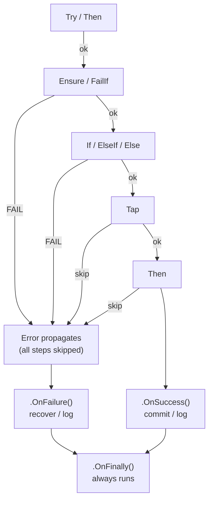

# FxResult

# FxResult

A fluent, exception-safe `Result<T>` for .NET — clean success/failure pipelines without throwing exceptions in business logic.

```
dotnet add package FxResult
```

## ✨ Features

- **`Result<T>` / `Result<RUnit>`** — struct-based success/failure wrapper with `IResult` for non-generic handling
- **Exception-safe** — `.Try()`, `.TryAsync()`, `.ThenTry()` capture exceptions as `Error` with caller location
- **Validation** — `.Ensure()`, `.FailIf()`, `.FailIfNull()` + async variants with `CancellationToken`
- **Chaining** — `.Then()`, `.ThenAsync()` with `out var` capture and `Result<RUnit>` overloads
- **Conditional** — `.If()` / `.ElseIf()` / `.Else()` branching with type-safe `ResultBranch` (sync + async)
- **Side-effects** — `.Tap()`, `.TapFailure()`, `.OnSuccess()`, `.OnFailure()`, `.OnFinally()` (sync/async)
- **Metadata** — `MetaInfo` with `CorrelationId`, `Additional`, `Trace`, pagination, `BuildLogScope()`
- **API responses** — `.ToResponseDto()` → `ResultResponse<T>` with `PublicErrorResponse`
- **Error model** — `record Error` with `Code`, `Message`, `Source`, `Caller`, `Exception`, `Location`, implicit conversions

🌐 [GitHub Repository](https://github.com/M-Meydan/FxResult)

---

## 🔁 How the Pipeline Works

Every step returns a `Result<T>`. On success the value flows forward. On failure the chain **short-circuits** — remaining steps are skipped and the error propagates unchanged until a hook handles it.



---

## 🧩 Usage Examples

### Full pipeline
```csharp
var result = await Result<string>
    .Try(() => GetUserInput())                                        // capture or wrap exception
    .Ensure(x => !string.IsNullOrWhiteSpace(x), "EMPTY", "Required") // validate: must pass
    .FailIf(x => x.Length < 3, "SHORT", "Too short")                 // validate: must not match
    .ThenAsync(x => FindInCacheAsync(x))                              // async transform
    .FailIfNullAsync("NOT_FOUND", "Not found")                       // null-safe unwrap
    .Tap(out var captured)                                            // capture intermediate value
    .Then(Save)                                                       // transform
    .OnFailure(res => { Log(res.Error); return res; })                // failure hook
    .OnSuccess(res => { Commit(res.Value); return res; })             // success hook
    .OnFinally(res => { Console.WriteLine("Done"); return res; });    // always runs
```

### Conditional branching
```csharp
// Route values through different processing paths
var result = Result<int>.Success(75)
    .If(x => x > 100, x => ApplyPremiumRate(x))
    .ElseIf(x => x > 50, x => ApplyStandardRate(x))
    .Else(x => ApplyBaseRate(x))
    .Then(FormatReceipt);   // ← continues the chain after branching

// Async branching
var result = await Result<int>.Success(75)
    .IfAsync(x => x > 100, LookupPremiumAsync)
    .ElseIfAsync(x => x > 50, LookupStandardAsync)
    .ElseAsync(LookupDefaultAsync);

// Fail if no branch matches
var result = Result<int>.Success(10)
    .If(x => x > 100, x => ProcessHighValue(x))
    .Else(x => Result<int>.Fail(new Error("OUT_OF_RANGE", "Value too low")));
```

---

## 📖 Quick Reference

| Category | Methods |
|---|---|
| **Create** | `Result<T>.Success()`, `.Fail()`, `.Try()`, `.TryAsync()`, implicit from `T` / `Error` |
| **Chain** | `.Then()`, `.ThenAsync()`, `.ThenTry()`, `.ThenTryAsync()` — with `out var` capture |
| **Validate** | `.Ensure()`, `.EnsureAsync()`, `.FailIf()`, `.FailIfAsync()`, `.FailIfNull()`, `.FailIfNullAsync()` |
| **Conditional** | `.If()` / `.ElseIf()` / `.Else()` + async: `.IfAsync()`, `.ElseIfAsync()`, `.ElseAsync()` |
| **Side-effects** | `.Tap()`, `.TapAsync()`, `.TapFailure()`, `.TapFailureAsync()`, `.Tap(out var)` |
| **Hooks** | `.OnSuccess()`, `.OnFailure()`, `.OnFinally()` + async + `CancellationToken` variants |
| **Metadata** | `.WithMeta()`, `.WithMetaData()`, `.WithTrace()`, `.BuildLogScope()` |
| **Pagination** | `.ToPagedResult(page, pageSize)` on `IEnumerable<T>` / `IQueryable<T>` |
| **API** | `.ToResponseDto()` → `ResultResponse<T>` |

For source, docs, and advanced usage, visit: 👉 https://github.com/M-Meydan/FxResult


